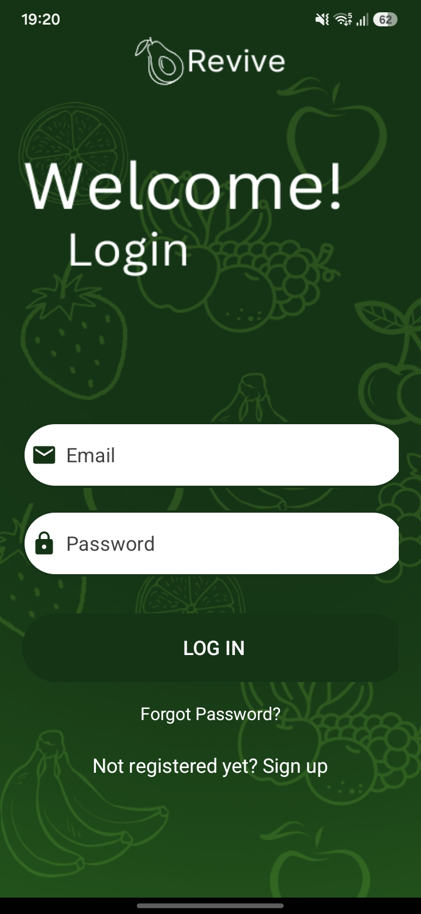
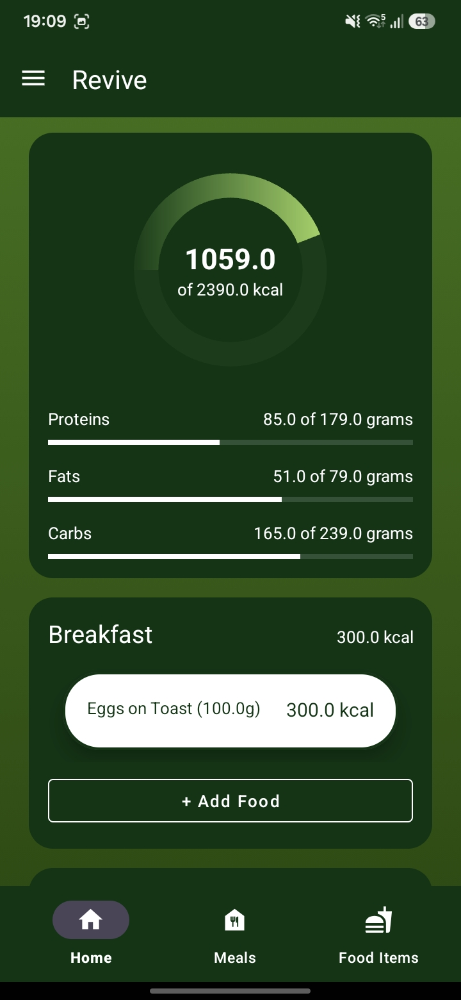
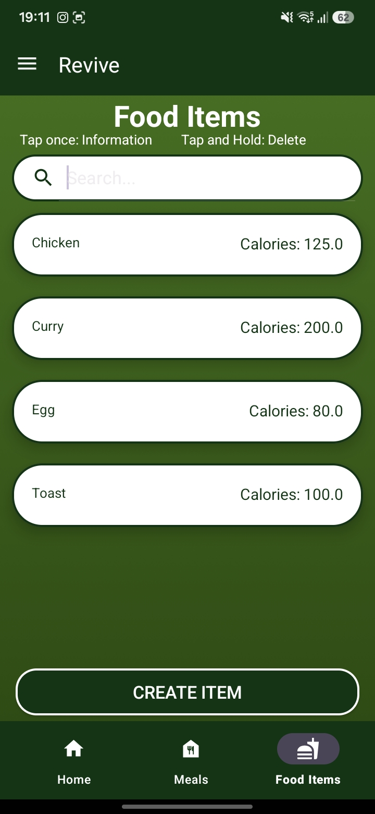
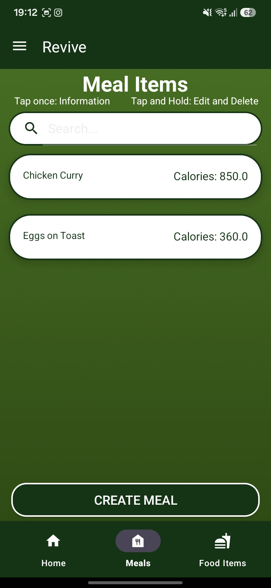
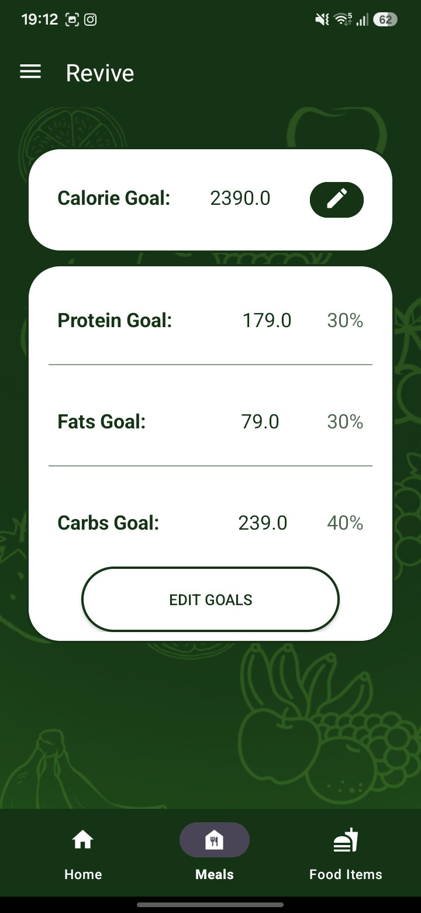
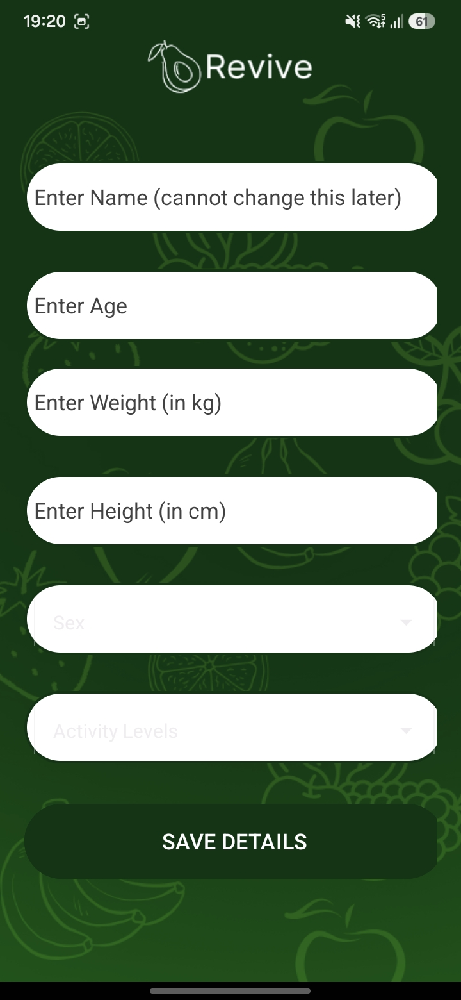
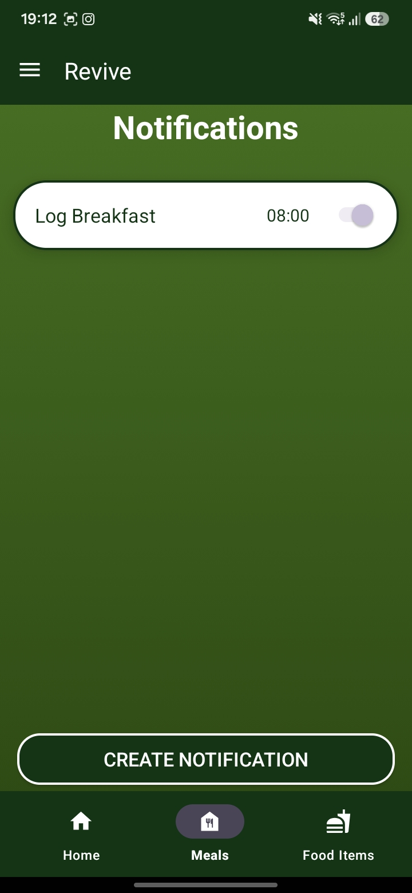
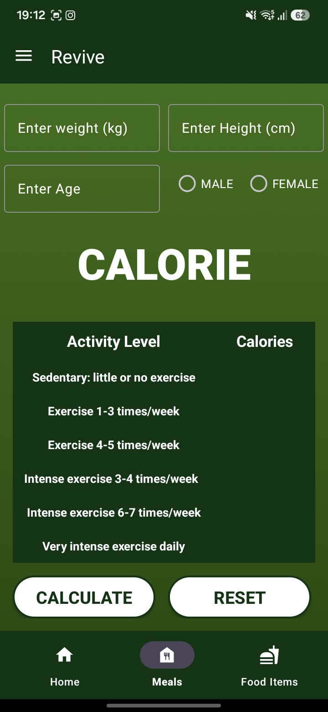

# Revive – Calorie & Nutrition Tracker

Revive is a native Android app for tracking daily calorie intake and macronutrients. It calculates a personalized calorie and macro target based on the user's stats and activity level, then lets them log food throughout the day against that target — with a food library, reusable custom meals, adjustable goals, and meal-reminder notifications. Data is synced per-user via Firebase.

---

## Table of Contents

- [Overview](#overview)
- [Features](#features)
- [Tech Stack](#tech-stack)
- [Project Structure](#project-structure)
- [Data Model & Firebase Structure](#data-model--firebase-structure)
- [Calorie & Macro Calculation](#calorie--macro-calculation)
- [Getting Started](#getting-started)
- [Roadmap](#roadmap)

---

## Overview

- Built with **Kotlin** (with one legacy **Java** screen for a standalone calorie calculator)
- Single-activity-style navigation: a **bottom navigation bar** (Home / Foods / Meals) plus a **side navigation drawer** (Profile / Personal Info / Notifications / Calculator / Daily Goals), all hosted inside `MainActivity`
- **Firebase Authentication** (email/password) gates access, and **Firebase Realtime Database** stores each user's profile, food items, meals, daily logs, and notification schedule
- On first login, a short onboarding form calculates a starting calorie target, deficit target, and macro split, which the user can later fine-tune

---

## Features

### 🔐 Authentication & Onboarding
- Email/password sign up and login via Firebase Auth
- "Forgot password" flow that verifies the email exists before sending a Firebase reset email
- Returning users are routed straight to the app; new users are routed to a **Personal Details** form (name, age, height, weight, sex, activity level) which calculates their starting calorie and macro targets



### 🏠 Home Dashboard
- Circular/linear progress toward the daily calorie goal, plus progress bars for protein, fat, and carbs
- Three meal sections — **Breakfast**, **Snacks**, **Dinner** — each with its own running calorie total and item list
- "Add food" opens a searchable dialog listing both individual food items and saved meals
- Tapping a logged item lets you edit its quantity or remove it
- Automatically detects a new day and resets the log, while keeping each day's history stored in Firebase



### 🍎 Food Library
- Add custom food items with calories, protein, fat, and carbs (entered per 100 g, stored normalized per gram internally)
- Live search/filter by name
- Tap an item to view full details; long-press for quick edit/delete options



### 🍽️ Meals
- Combine multiple food items (each with its own quantity) into a reusable custom meal
- Search saved meals, view a full nutritional breakdown, or edit/delete an existing meal
- Meals can be added to the daily log in one tap from the Home screen



### 🎯 Daily Goals
- View current calorie and macro targets at a glance
- Manually edit the daily calorie goal — macro gram targets automatically recalculate from the saved percentage split
- Adjust the protein/fat/carb split with sliders that snap to 5% increments and must total 100%



### 👤 Personal Info & Profile
- View and edit individual profile fields (age, height, weight, sex, activity level) one at a time via a shared dialog
- "Recalculate calories" re-runs the formula with current stats and flags whether the target has actually changed
- Profile tab shows name and email, with a logout action



### 🔔 Meal Reminder Notifications
- Create named reminders with a specific time using hour/minute pickers
- Toggle individual reminders on/off
- Reminders repeat daily via **WorkManager**, and the app requests the `POST_NOTIFICATIONS` runtime permission on Android 13+



### 🧮 Standalone Calorie Calculator
- A quick, profile-independent calculator: enter age, height, weight, and gender to estimate calorie needs across six activity levels (using the Harris-Benedict formula)



---

## Tech Stack

| Layer | Technology |
|---|---|
| Language | Kotlin (primary), Java (`CalorieCalculatorFragment`) |
| UI | Android Fragments, ViewBinding, Material Components, RecyclerView |
| Auth | Firebase Authentication (email/password) |
| Database | Firebase Realtime Database |
| Background work | WorkManager (periodic notification scheduling) |
| Navigation | Bottom Navigation View + Navigation Drawer inside a single host `Activity` |

---

## Project Structure

**Auth & onboarding**
`LoginActivity` · `SignupActivity` · `PersonalDetailsActivity`

**App shell**
`MainActivity` — hosts all fragments via bottom navigation (Home / Foods / Meals) and a navigation drawer (Profile / Personal Info / Notifications / Calculator / Daily Goals)

**Fragments**
`HomeFragment` · `ItemFragment` · `MealFragment` · `CreateMealFragment` · `DailyGoalsFragment` · `PersonalInfoFragment` · `ProfileFragment` · `NotificationsFragment` · `CreateNotificationFragment` · `CalorieCalculatorFragment`

**Data models**
`FoodItem` · `Meal` · `FoodItemWithQuantity` · `DailyMeals` · `PersonalInfo` · `NotificationItem`

**Adapters**
`HomeMealAdapter` · `FoodItemAdapter` · `MealAdapter` · `SelectedFoodsAdapter` · `NotificationAdapter`

---

## Data Model & Firebase Structure

All user data lives under a single node keyed by the Firebase Auth UID:

```
Information/
└── {userId}/
    ├── personal information/     → PersonalInfo (stats, calorie & macro targets)
    ├── Food items/
    │   └── {foodName}/           → FoodItem (calories/protein/fat/carbs, stored per gram)
    ├── Meals/
    │   └── {mealName}/           → Meal (name, food items map, totals)
    ├── DailyMeals/
    │   └── {yyyy-MM-dd}/         → DailyMeals (date, breakfast/snacks/dinner maps, daily totals)
    └── Notifications/
        └── {notificationId}/     → NotificationItem (name, time, enabled state)
```

`FoodItem` values are stored normalized to **per-gram** amounts internally and converted to **per-100g** for display, so quantities logged in `DailyMeals` and `Meals` are calculated as `nutrient-per-gram × grams`.

---

## Calorie & Macro Calculation

The profile-based calculation (`PersonalInfo.calculatecalories()`) works as follows:

1. Estimate BMR using a Harris-Benedict-style formula based on sex, weight, height, and age
2. Multiply by an activity factor:

   | Activity Level | Multiplier |
   |---|---|
   | Little | 1.0 |
   | Light | 1.2 |
   | Moderate | 1.35 |
   | Active | 1.5 |
   | Very Active | 1.7 |

3. Floor the result at 1,200 kcal
4. Subtract 500 kcal to produce the daily **deficit calorie** target
5. Split the deficit target into protein/fat/carb grams using an adjustable percentage split (default 30% / 30% / 40%), converted via 4 kcal/g (protein, carbs) and 9 kcal/g (fat)

The standalone **Calorie Calculator** screen uses a similar Harris-Benedict approach but shows results across six fixed activity multipliers (1.2–1.89) independently of any saved profile.

---

## Getting Started

### Prerequisites
- Android Studio (recent stable version)
- A Firebase project with:
  - **Authentication** → Email/Password sign-in enabled
  - **Realtime Database** created (in a region matching your `databaseURL`)
- Your own `google-services.json` for the app module

### Installation
1. Clone the repository
2. Open the project in Android Studio
3. Update the Firebase Realtime Database URL references throughout the codebase to point to your own instance
4. Add your `google-services.json` to the `app/` module
5. Build and run on an emulator or device
   - Android 8.0 (API 26)+ recommended for notification channel support
   - Android 13 (API 33)+ will prompt for the `POST_NOTIFICATIONS` runtime permission

---

## Roadmap

Some possible next steps for the project:

- Historical charts/trends for calories and macros over time
- Barcode scanning or a third-party food database integration
- Offline support / local caching for food and meal data
- Export daily logs (CSV/PDF)
- Unit tests around the calorie/macro calculation logic

---

*Built as a personal nutrition-tracking project using Kotlin, Firebase, and Android Jetpack components.*
